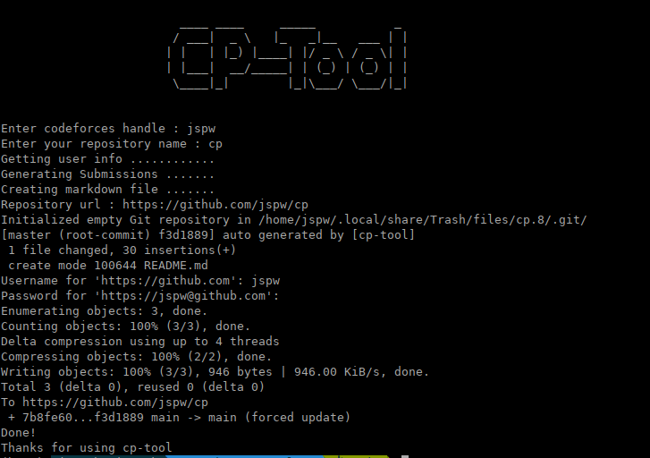
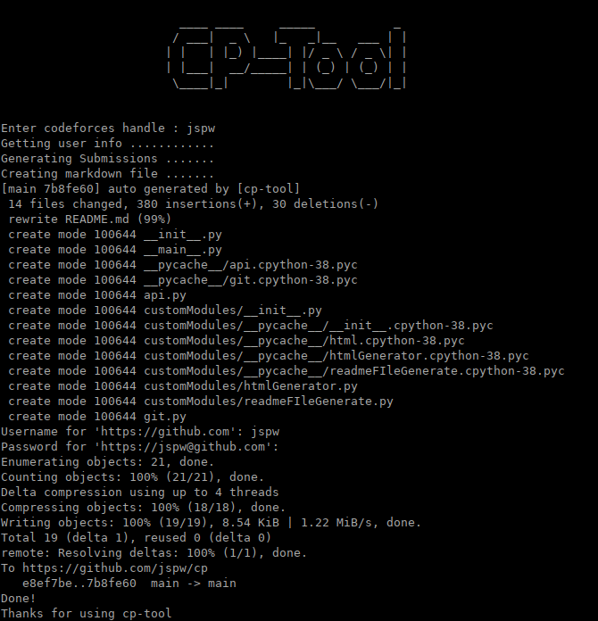

# cp-tool

 

**cp-tool** is an auto generator for solved problems at different online judges. It gathers all the problems you have solved at an online judge and generates a git repository for you.

Generated [Sample](cpTool/SAMPLE.md) markdown file.

## Supported Platforms

- [Codeforces](https://codeforces.com)

## Requirments

- python >=3.6

## Instruction

- ### Installation

>     pip install cp-tool

- ### Usage

  - Init with git repo :

    - Create a git repository first
    - Then init

      >     cp-tool --init

      

  - Update submissions :

    >      cp-tool --cf

    

## License

[GNU 3](LICENSE)
